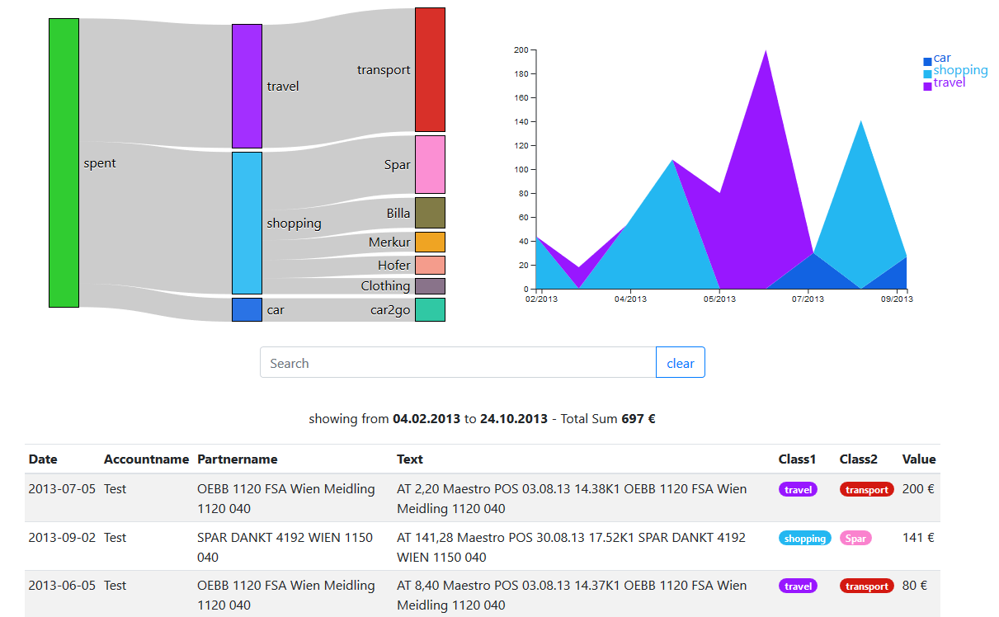

# whereismymoney
browser based visualization &amp; categorization of cash flow; including import scripts

this is my first public package so it lacks a lot of QoL features for setting up, switching between git version & local data and so on..

# How to set up
1. Put your bankstatements into the /import folder (& delete the sample file if you dont want it imported)
2. open the statements.db, Accounts table needs to be filled. 
   
   **IMPORTANT:** import script iterates through /import folder and looks for the IBAN in the file name

3. run python_scripts/importStmts.py to import all data into the table "Statements"
4. check /db/statements.db if everything is in - table "Statements_Log"
4. edit /data/classification.json (make a copy of classification_sample.json)
   * section "grouping" has classification on 2 lvls
   * section "own_transfers" lets you flag out own transfers by booking text (else it's done via Accounts table & checking counterparty in the data, sometimes bank statements don't show counterparty - specially when they are older..)
5. run python_scripts/scheduleScripts.py - this will keep running and run classification whenever the classification.json file changes
6. start up the NodeJS server and enjoy the visuals ;)

# How to use
1. navigate to/reload http://localhost:3000/
2. browse categories (click sankey), filter time (click/drag on stacked area chart) & check statements (table below graphs including text filter)
3. while python_scripts/scheduleScripts.py is running, edit classification.json, database will be automatically updated on file-save
4. go to step 1

# ToDo
things that should be done, in no particular order

  * generally
    * move db filename, classification filename et al to config rather than have it in code
  * import & classification script (python)
    * allow classifcation also on Counterparty (now its only text of booking)
    * refactor importStmts.py to be more forgiving if a column name is different
    * virtualenv/containerization for dependencies
  * visualization (nodejs)
    * toggle between cash out & cash in (currently only cash out)
    * handle dependencies automatically (?)
